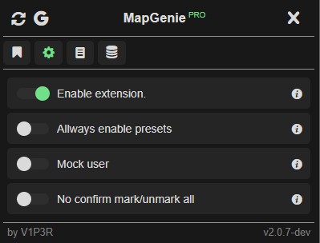
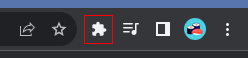
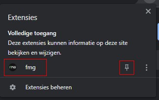
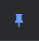
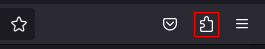
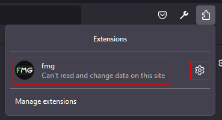
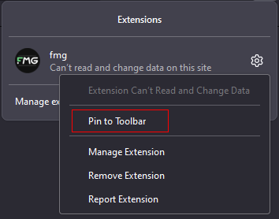
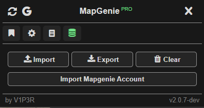

<h1 align="center">Browser Action Popup</h1>

    
    

<ul>
    <li><a href="#pinning">Pinning the browser action</a></li>
    <ul>
        <li><a href="#chrome-pinning">Chrome</a></li>
        <li><a href="#firefox-pinning">Firefox</a></li>
    </ul>
    <li><a href="#using">Using the browser action</a></li>
    <ul>
        <li>
            <a href="#bookmarks">
                
                Bookmarks
            </a>
        </li>
        <li>
            <a href="#settings">
                
                Settings
            </a>
        </li>
        <li>
            <a href="#info">
                
                Info
            </a>
        </li>
        <li>
            <a href="#data">
                
                Data
            </a>
        </li>
    </ul>
</ul>

<h2 id="pinning">Pinning the browser action</h2>
<h3 id="chrome-pinning">Chrome</h3>
<ol>
    <li>
        
Press the <code>puzzle piece icon</code> on the top right balk.

        

    </li>
    <li>
        
Search for the <code>fmg</code> extension and press the <code>drawing pin</code> icon.

        

    </li>
    <li>
        
The <code>drawing pin</code> should turn blue.

        

    </li>
</ol>
<h3 id="firefox-pinning">Firefox</h3>
<ol>
    <li>
        
Press the <code>puzzle piece icon</code> on the top right balk.

        

    </li>
    <li>
        
Search for the <code>fmg</code> extension and press the <code>gear</code> icon.

        

    </li>
    <li>
        
Press <code>Pin to Toolbar</code>.

        

    </li>
</ol>

<h2 id="using">Using the browser action</h2>
<h3 id="bookmarks">
    
    Bookmarks
</h3>

    The bookmarks page allows you to bookmark any mapgenie map, 
    So you can quickly load your favorite maps.

> [!NOTE]
> To add a bookmark simply go to your map page,
> and press the <code>[+]</code> button to add it to your bookmarks.

> [!NOTE]
> To remove bookmarks press the `trashcan` button in the top right corner.
> And click any bookmark you want to delete.
> After you done press the `trashcan` button again.

<h3 id="settings">
    
    Settings
</h3>

<table>
    <thead>
        <tr>
            <th>Setting</th>
            <th>Description</th>
        </tr>
    </thead>
    <tbody>
        <tr>
            <td>Allways enable presets</td>
            <td>This setting will enable presets on every map.</td>
        </tr>
        <tr>
            <td>Mock user</td>
            <td>
                This setting will enable user mocking.
                This means it will create a dummy user with id -1.
                This will allow you to use all features without logging in.
            </td>
        </tr>
        <tr>
            <td>No confirm mark/unmark all</td>
            <td>
                This will remove the confirm dialog when clicking on the mark/unmark all
                visible locations buttons.
            </td>
        </tr>
    </tbody>
<table>

<h3 id="info">
    
    Info
</h3>

The info page can show some usfull information.

<table>
    <thead>
        <tr>
            <th>Info</th>
            <th>Description</th>
        </tr>
    </thead>
    <tbody>
        <tr>
            <td>PageType</td>
            <td>
                Indicates what page type the extension thinks your currently on.
                <code>map, guide, map-selector, homepage or unknown</code>.
            </td>
        </tr>
        <tr>
            <td>Attached</td>
            <td>
                This indicates if the content script is attached correctly without any errors.
                Red means did not attach correctly or page type is unknown.
                Green means did attach correctly.
                Notice green does not always mean that the extension is working correctly.
                The console window should provide better info for that.
            </td>
        </tr>
    </tbody>
<table>

<h3 id="data">
    
    Data
</h3>

    The data page allows you to manipulate the current map page's data.

<table>
    <thead>
        <tr>
            <th>Button</th>
            <th>Action</th>
        </tr>
    </thead>
    <tbody>
        <tr>
            <td>Import</td>
            <td>
                This will import a user selected json for the current map page.
                This will error if the `gameId` or `mapId` does not match with the current map page.
                It will also warn you if you try to import data from another user, You can say yes or no if you want to import it anyway.
            </td>
        </tr>
        <tr>
            <td>Export</td>
            <td>
                This will export the stored data for the current map page.
            </td>
        </tr>
        <tr>
            <td>Export</td>
            <td>
                This will clear all the data for the current map page.
                Will ask for a confirmation first to make sure you don't accidently press
                the clear button.
            </td>
        </tr>
    </tbody>
<table>

